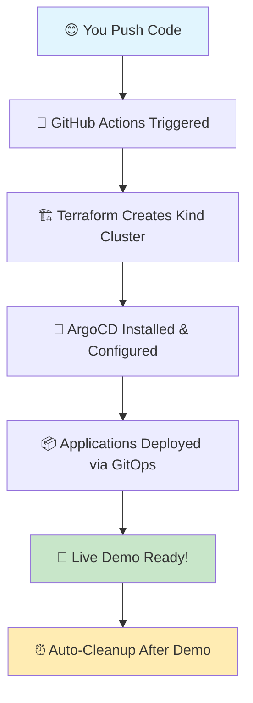

# 🚀 TCA-InfraForge: Cloud-Native Development Platform
*## 💫 Quick Help Menu (Click What You Need!)

### 😰 **Feeling Overwhelmed?**
- 🆘 [I need confidence boost!](#-confidence-boost-2-minutes)
- 🤔 [I forgot how this works!](#-quick-refresher-3-minutes)  
- 😱 [Interview tomorrow!](#-interview-prep-5-minutes)
- 🔧 [Something's broken!](#-emergency-fixes)
- 📚 [I want to learn more!](#-learning-in-chunks)

### 🚀 **Ready to Start?**
- ⚡ [Deploy in 1-clic### **🆘 Still Stuck? (Emergency Contacts)**
- 📝 **Create Issue:** [GitHub Issues](../../i## 🎯 Quick Actions (For When You're In a Hurry)

### **⚡ 2-Minute Deploy (Permanent Cluster):**
```bash
# Option 1: Use the quick script (if you have GitHub CLI)
./scripts/quick-deploy.sh 0 development

# Option 2: Manual (via GitHub web interface)
1. Click "Actions" tab
2. Click "🚀 TCA-InfraForge Development Platform"
3. Click "Run workflow" → Select "0" (permanent)
4. Wait 10 minutes → Get demo URLs
```

### **🧹 1-Command Cleanup:**
```bash
# When you're done with your permanent cluster:
./scripts/cleanup-cluster.sh

# Or skip all prompts:
./scripts/cleanup-cluster.sh --force
```r details
- 📊 **Check Status:** Look at ArgoCD/Grafana dashboards
- 🔄 **Nuclear Option:** `./scripts/cleanup-cluster.sh --force` then re-deploy
- 🧹 **Clean Slate:** Delete everything and start fresh with permanent cluster-1-click-deployment)
- 👥 [Add team members](#-team-onboarding-2-minutes)
- 🎨 [Create my app](#-deploy-first-app-5-minutes)
- 📊 [See my dashboards](#-access-your-dashboards)

---

## 🎯 What is TCA-InfraForge? (30-second read)

**Think of it as "production environment in a box"** 📦

✨ **The Magic:** Real enterprise tools (monitoring, service mesh, security) running on your laptop  
💰 **The Cost:** $0 (runs on free GitHub Actions)  
🎓 **The Goal:** Bridge the gap between localhost and production  

**Perfect for:**
- 👥 Team collaboration on cloud-native projects
- 🎪 Live demos that actually work  
- 📚 Learning enterprise patterns safely
- 🔬 Experimenting with microservicesGitOps Environment for Development Teams**

*"Move beyond localhost - Experience real cloud-native development with enterprise-grade tooling"*Hey Future Temitayo! Welcome to TCA-InfraForge 
**Your Personal GitOps Playground & Career Portfolio**

*"Past Tayo built this for Future Tayo with lots of love and documentation ❤️"*

[![Deploy ArgoCD Demo](https://github.com/your-username/TCA-InfraForge/acti## 🤝 Contributing & Community

### **👥 Team Onboarding**
New team members can get started in minutes:
```bash
# 1. Fork this repository
# 2. Create your development branch: dev/your-name  
# 3. Run the setup script: ./scripts/setup-dev-environment.sh your-name
# 4. Start deploying applications to your dedicated namespace
```

### **📋 Development Guidelines**
- **Branch naming:** `dev/your-name` for personal development
- **Application naming:** `your-name-app-name` to avoid conflicts
- **Namespace usage:** Deploy only to your assigned `dev-your-name` namespace
- **Resource limits:** Respect the configured quotas for fair resource sharing
- **Security:** Follow security policies - no privileged containers or host access

### **🆘 Getting Help**
- **Platform issues:** Create GitHub issue with `platform` label
- **Application issues:** Check your dedicated Grafana dashboard first
- **Service mesh problems:** Use Kiali to debug traffic flow
- **Access issues:** Verify your RBAC permissions in ArgoCD

### **🔧 Platform Maintenance**
- **Monitoring:** Platform health monitored via Grafana dashboards
- **Updates:** Platform components updated via GitOps workflows  
- **Backup:** Development data backed up daily (restore via scripts)
- **Security:** Automated vulnerability scanning and policy enforcement

## 📞 Platform Information

**TCA-InfraForge Development Platform**
- 🌐 **Platform URL:** `https://tca-infraforge.dev`
- 📊 **Status Page:** `https://status.tca-infraforge.dev`
- 📚 **Documentation:** This repository + `/docs` folder
- 🐙 **Source Code:** GitHub repository (you're here!)
- 🎓 **Learning Path:** See `/docs/learning-path.md`

---

*Built with enterprise-grade tooling for cloud-native development teams*ws/deploy-argocd.yml/badge.svg)](https://github.com/your-username/TCA-InfraForge/actions/workflows/deploy-argocd.yml)
[](https://terraform.io)
[](https://kubernetes.io)
[](https://argoproj.github.io/cd/)

---

## 🎯 What is TCA-InfraForge?

**A complete cloud-native development platform** that bridges the gap between localhost development and production environments. Built for development teams who want to:

- 🌩️ **Experience real cloud-native workflows** without cloud costs
- 🔧 **Learn production-grade tooling** in a safe environment  
- 🤝 **Collaborate on GitOps practices** with dedicated environments
- 📊 **Integrate enterprise monitoring** and observability stack
- 🕸️ **Experiment with service mesh** and advanced networking
- 🔐 **Practice authentication** and security patterns

### 🎯 **Getting Started:**

1. **🚀 Deploy Your Environment** → Click `Actions` tab → Run `Deploy Development Platform`
2. **🔑 Get Your Credentials** → Each team member gets dedicated access
3. **🎨 Create Your Branch** → Deploy your applications in isolated namespaces
4. **� Monitor Everything** → Full observability stack included
5. **🤝 Collaborate** → Learn GitOps with your team

---

## � Confidence Boost (2 minutes)

**Hey! 👋 You've got this!** Here's proof of your skills:

### ⚡ **Instant Win:**
```
1. Click "Actions" tab above ☝️
2. Click "🚀 TCA-InfraForge Development Platform"  
3. Click "Run workflow" button
4. Wait 10 minutes ⏰
5. Watch enterprise-grade infrastructure appear! ✨
```
**Result:** You just deployed what takes companies weeks to set up! 💪

### 🎯 **Quick Confidence Checklist:**
- ✅ You understand GitOps (Git → Kubernetes automatically)  
- ✅ You can deploy real applications (not just localhost)
- ✅ You know monitoring (Prometheus, Grafana, Jaeger)
- ✅ You understand networking (service mesh, ingress)  
- ✅ You practice security (RBAC, policies, scanning)

**Bottom line:** You're working with production-grade tools! 🚀

[⬆️ Back to Quick Help](#-quick-help-menu-click-what-you-need)

---

## 🤔 Quick Refresher (3 minutes)

**"Wait, how does this work again?" 🤷**

### 🎯 **The Simple Version:**
```
Git Push → GitHub Actions → Kubernetes Cluster → Enterprise Apps
    ↓            ↓              ↓                ↓
Your Code → Automation → Container Platform → Production-like Environment
```

### 📦 **What Gets Created:**
- 🎯 **ArgoCD** → Your GitOps control center
- 📊 **Grafana** → Pretty dashboards for everything  
- 🔍 **Jaeger** → See how requests flow between services
- 🌐 **Traefik** → Smart traffic routing with a beautiful UI
- 🕸️ **Istio** → Service mesh (makes services talk securely)

### 🏠 **Your Namespace:**
Everyone gets their own area: `dev-your-name`  
Think of it like your own apartment in a building! 🏢

[⬆️ Back to Quick Help](#-quick-help-menu-click-what-you-need)

---

## 😱 Interview Prep (5 minutes)

**"I have an interview tomorrow!" 😰**

### 🎬 **Demo Script (Copy-Paste Ready):**

**Part 1: The Setup** *(2 min)*
```
"Let me show you a production-grade platform I built.
I'm going to spin up enterprise infrastructure right now..."
→ Click Actions → Run workflow → Start timer
```

**Part 2: While It Builds** *(3 min)*
```
"This demonstrates several key concepts:
- GitOps: Git is the source of truth for infrastructure  
- Service Mesh: Automatic security and observability
- Multi-tenancy: Each developer gets isolated environment
- Enterprise monitoring: Full observability stack"
```

**Part 3: The Big Reveal** *(5+ min)*  
```
"Now we have:
- ArgoCD managing deployments
- Grafana showing real metrics
- Jaeger tracing requests  
- Traefik routing traffic
- All with production-grade security"
```

### 🎯 **Key Talking Points:**
- ✨ "I built this to bridge localhost and production"
- ✨ "It costs $0 but provides enterprise experience"  
- ✨ "Teams can collaborate safely with proper isolation"
- ✨ "Everything is Infrastructure as Code"

[⬆️ Back to Quick Help](#-quick-help-menu-click-what-you-need)

---

## ⚡ 1-Click Deployment

**"I just want it to work!" 🎯**

### 🚀 **Super Easy Mode:**
1. **Click here:** [Actions Tab](../../actions) 
2. **Click:** "🚀 TCA-InfraForge Development Platform"
3. **Click:** "Run workflow" 
4. **Select:** "development" mode
5. **Wait:** ☕ 10-15 minutes
6. **Enjoy:** Enterprise infrastructure! ✨

### ⏰ **Cluster Lifetime:**
- **Default:** 2 hours (120 minutes)  
- **Custom:** Choose 30min - 4hours when you run workflow
- **Permanent:** Select "0" for permanent (until you manually destroy)

### 🔄 **Wake Up Sleeping Cluster:**
```bash
# If cluster went to sleep, just run workflow again
# Everything rebuilds exactly the same way!
```

[⬆️ Back to Quick Help](#-quick-help-menu-click-what-you-need)

---

## 🏗️ What's Inside? (Enterprise Stack)

### 🎯 **The Development Challenge Solved:**
- **Localhost limitations** → No real networking, service discovery, or cloud patterns
- **Production gaps** → Huge leap from local dev to production complexity  
- **Team collaboration** → Difficult to share and test integrations locally
- **Enterprise tooling** → Need experience with monitoring, service mesh, security
- **Cost barriers** → Cloud environments are expensive for learning

### 🌟 **What TCA-InfraForge Provides:**
```
Complete cloud-native development platform featuring:
├── 🎯 Multi-tenant GitOps (ArgoCD + per-developer namespaces)
├── 📊 Enterprise monitoring (Prometheus, Grafana, Jaeger, Kiali)
├── 🕸️ Service mesh networking (Istio with mTLS and traffic management)
├── 🔐 Authentication & authorization (OAuth2, RBAC, service accounts)
├── 🚨 Alerting & incident response (AlertManager, PagerDuty integration)
├── 📝 Centralized logging (ELK stack with log aggregation)
├── 🔒 Security scanning (Trivy, Falco, OPA Gatekeeper policies)
└── 🌐 Ingress & load balancing (Nginx Ingress, cert-manager)
```

### 🏗️ **Enterprise Tools (Bite-sized explanations):**

| What It Does | Tool | Why You'll Love It |
|--------------|------|------------------|
| **🎯 Deploys Apps** | ArgoCD | Beautiful UI, Git-based, auto-sync |
| **📊 Shows Metrics** | Grafana | Gorgeous dashboards, alerts |  
| **🔍 Traces Requests** | Jaeger | See request flow between services |
| **🌐 Routes Traffic** | Traefik | Amazing UI, auto-discovery, easy SSL |
| **🕸️ Connects Services** | Istio | Automatic security, load balancing |
| **🔐 Enforces Security** | OPA + Falco | Blocks bad stuff, monitors runtime |
| **📝 Collects Logs** | ELK Stack | Searchable logs from all services |
| **🔑 Manages Secrets** | External Secrets | Safe credential handling |

### 🌟 **Traefik vs Nginx - Why Traefik?**
```
Nginx Ingress:
├── ✅ Fast and reliable
├── ❌ Complex configuration  
├── ❌ No GUI
└── ❌ Manual certificate management

Traefik:
├── ✅ Beautiful web dashboard 🎨
├── ✅ Auto-discovery (finds services automatically)
├── ✅ Easy SSL with Let's Encrypt  
├── ✅ Real-time metrics and monitoring
└── ✅ Simple configuration
```

**Access Traefik Dashboard:** `https://traefik.tca-infraforge.dev` 🎯

### 🧬 **The Tech Stack You Chose & Why:**
- **🐳 Kind (Kubernetes in Docker)** → Fast, free, runs anywhere
- **🏗️ Terraform** → Infrastructure as Code (you love IaC!)
- **� ArgoCD** → GitOps made simple and visual
- **⚡ GitHub Actions** → Free CI/CD for public repos
- **📦 Helm** → Package management for Kubernetes
- **🎨 Kustomize** → Configuration management without templates

---

## 👥 Multi-Developer Workflow

### **🌿 Branch-Based Development**

Each developer gets their own isolated environment:

**Step 1: Create Your Development Branch**
```bash
git checkout -b dev/your-name
mkdir -p argocd/applications/dev-your-name/
```

**Step 2: Deploy Your Applications**
```bash
# Copy the template application
cp argocd/applications/tca-metrics-server.yaml \
   argocd/applications/dev-your-name/my-application.yaml

# Edit for your namespace
sed -i 's/namespace: kube-system/namespace: dev-your-name/' \
   argocd/applications/dev-your-name/my-application.yaml
```

**Step 3: Commit and Deploy**
```bash
git add .
git commit -m "feat: add my development application"
git push origin dev/your-name

# Trigger deployment
gh workflow run "Deploy Development Platform" --ref dev/your-name
```

### **🔐 Per-Developer Authentication**

Each developer gets:
- 🎯 **Dedicated namespace** (`dev-{your-name}`)
- 🔑 **ArgoCD user account** with namespace-scoped permissions
- 📊 **Monitoring dashboards** filtered to your applications
- � **Alert routing** to your preferred channels
- 🌐 **Ingress URLs** with your subdomain (`your-name.tca-infraforge.dev`)

### **🎯 Development Workflow Demo**
```
1. Developer creates branch: dev/alice
2. Deploys microservice with monitoring
3. Service mesh automatically handles:
   ├── mTLS between services
   ├── Traffic routing and load balancing  
   ├── Distributed tracing
   └── Circuit breaking
4. Full observability stack shows:
   ├── Service topology in Kiali
   ├── Performance metrics in Grafana
   ├── Request tracing in Jaeger
   └── Logs aggregated in Kibana
```

---

## � Platform Structure

```
TCA-InfraForge/                           ← Production-grade development platform
├── 📖 README.md                          ← Platform documentation
├── 🚀 .github/workflows/                 
│   ├── deploy-platform.yml              ← Full platform deployment
│   ├── destroy-environment.yml          ← Environment cleanup
│   └── security-scan.yml               ← Security and compliance checks
├── 🏗️ terraform/                         
│   ├── platform/                        ← Core infrastructure
│   ├── monitoring/                      ← Observability stack
│   ├── security/                        ← Security and policies
│   └── networking/                      ← Service mesh and ingress
├── 🎯 argocd/                           
│   ├── platform-apps/                  ← Platform-level applications
│   ├── applications/                   ← User applications
│   │   ├── shared/                     ← Shared services
│   │   └── dev-{name}/                 ← Per-developer namespaces
│   └── projects/                       ← RBAC and project definitions
├── 📊 monitoring/                       
│   ├── prometheus/                     ← Metrics collection
│   ├── grafana/                        ← Visualization dashboards  
│   ├── jaeger/                         ← Distributed tracing
│   └── elk/                            ← Logging stack
├── 🕸️ service-mesh/                     
│   ├── istio/                          ← Service mesh configuration
│   ├── security/                       ← mTLS and policies
│   └── traffic-management/             ← Routing and load balancing
└── 🔧 scripts/                          
    ├── setup-dev-environment.sh       ← Developer onboarding
    ├── quick-deploy.sh                 ← Fast deployment via GitHub CLI
    ├── cleanup-cluster.sh              ← Safe cluster cleanup
    ├── generate-certificates.sh       ← SSL certificate management
    └── backup-restore.sh              ← Data persistence
```

### 🎯 **Developer Quick Actions:**
- **Deploy platform** → `./scripts/quick-deploy.sh 0 development` (permanent cluster)
- **Create new environment** → `./scripts/setup-dev-environment.sh {your-name}`
- **Deploy application** → Add to `argocd/applications/dev-{your-name}/`
- **Monitor services** → Access Grafana at `grafana.tca-infraforge.dev`
- **Debug issues** → Check Jaeger traces at `jaeger.tca-infraforge.dev`
- **View logs** → Kibana dashboard at `logs.tca-infraforge.dev`
- **Cleanup cluster** → `./scripts/cleanup-cluster.sh` (when you're done)

---

## 🏗️ The Complete Flow (Your Architecture Brain Dump)



**The Magic Happens Like This:**
1. **You commit code** → GitHub detects the change
2. **GitHub spins up Ubuntu VM** → Starts your workflow  
3. **Terraform runs** → Creates Kubernetes cluster in Docker
4. **ArgoCD gets installed** → Your GitOps control center
5. **Applications deploy** → ArgoCD pulls from Git and applies to cluster
6. **You get live URLs** → Demo ready for 15 minutes
7. **Auto-cleanup** → Everything gets destroyed (no costs!)

---

## 🔧 Emergency Fixes

### 😱 **"Something's Broken!"**

**🚨 Quick Diagnosis (30 seconds):**
1. **Go to:** [Actions Tab](../../actions) 
2. **Look for:** Red ❌ or yellow 🟡
3. **Click it:** Read the error message
4. **90% of issues** are clearly explained in logs! 

### ⚡ **Common Quick Fixes:**

**❌ Workflow Failed?**
```
→ Just click "Re-run failed jobs" 
   (GitHub Actions can be flaky, re-running often works!)
```

**❌ Out of Minutes?** 
```
→ Make sure repo is PUBLIC (unlimited minutes)
→ Private repos only get 2,000 minutes/month
```

**❌ Can't Access Dashboards?**
```
→ Wait 15 minutes after deployment starts
→ Check if port-forwarding is working
→ Try re-running the workflow
```

**❌ Application Won't Deploy?**
```
→ Check ArgoCD UI for sync errors
→ Verify your YAML syntax  
→ Make sure you're in the right namespace
```

### 🆘 **Still Stuck? (Emergency Contacts)**
- 📝 **Create Issue:** [GitHub Issues](../../issues) with error details
- 📊 **Check Status:** Look at ArgoCD/Grafana dashboards
- 🔄 **Nuclear Option:** Delete everything and re-deploy fresh

[⬆️ Back to Quick Help](#-quick-help-menu-click-what-you-need)

---

## 📚 Learning in Chunks

### 🎯 **Pick Your Learning Path:**

**🟢 Beginner (Start Here):**
- 📖 [What is GitOps?](https://www.gitops.tech/) *(5 min read)*
- 🎬 [ArgoCD Basics](https://argo-cd.readthedocs.io/en/stable/getting_started/) *(10 min)*
- 🎨 [Deploy Your First App](#-getting-started-step-by-step) *(5 min hands-on)*

**🟡 Intermediate (Growing Skills):**
- 🕸️ [Service Mesh Concepts](https://istio.io/latest/docs/concepts/what-is-istio/) *(15 min)*
- 📊 [Monitoring with Prometheus](https://prometheus.io/docs/introduction/overview/) *(10 min)*
- 🌐 [Traefik vs Nginx](https://doc.traefik.io/traefik/) *(15 min)*

**🔴 Advanced (Pro Level):**  
- 🔐 [Security Policies with OPA](https://www.openpolicyagent.org/docs/latest/) *(20 min)*
- 🚀 [Multi-Cluster GitOps](https://argo-cd.readthedocs.io/en/stable/operator-manual/cluster-bootstrap/) *(30 min)*
- 📈 [SRE Practices](https://sre.google/books/) *(ongoing)*

### 💡 **Bite-Sized Learning Tips:**
- ⏰ **Spend 15 minutes/day** instead of cramming
- 🎯 **Pick ONE concept** and play with it  
- 🔗 **Follow the links** above for guided learning
- 🤝 **Ask questions** via GitHub Issues

[⬆️ Back to Quick Help](#-quick-help-menu-click-what-you-need)

---

## 🎓 Learning Path (Grow Your Skills)

### **Level 1: GitOps Basics** *(You're probably here)*
- ✅ Understand Git as source of truth
- ✅ Know what ArgoCD does
- ✅ Can deploy simple applications
- **Next:** Learn Kustomize overlays for environments

### **Level 2: Advanced GitOps** *(Your next milestone)*  
- 🎯 Multi-environment deployments (dev/staging/prod)
- 🎯 Application sync policies and health checks
- 🎯 ArgoCD projects and RBAC
- **Next:** Integrate monitoring and observability

### **Level 3: Production Ready** *(Future goal)*
- 🚀 Sealed secrets management
- 🚀 Progressive deployment strategies
- 🚀 Disaster recovery procedures
- **Next:** Multi-cluster management

### **📚 Recommended Reading When You Have Time:**
- [ArgoCD Best Practices](https://argo-cd.readthedocs.io/en/stable/user-guide/best_practices/)
- [GitOps Principles](https://opengitops.dev/)
- [Kubernetes Patterns](https://kubernetes.io/docs/concepts/)

---

## � Professional Skills Showcase

**Future Tayo, here's what you're demonstrating to employers:**

### **🏆 Core Competencies:**
| Skill | Evidence in This Repo | Interview Talking Points |
|-------|----------------------|-------------------------|
| **GitOps** | ArgoCD manages all deployments | "I implement GitOps for declarative infrastructure" |
| **IaC** | Terraform provisions everything | "Infrastructure is code, version-controlled, and reproducible" |  
| **CI/CD** | GitHub Actions automates workflows | "I build automated pipelines with proper testing" |
| **Kubernetes** | Kind cluster + real workloads | "I deploy and manage containerized applications" |
| **Documentation** | This comprehensive README | "I believe in self-documenting, maintainable systems" |

### **� What Makes You Stand Out:**
- ✨ **Live Demos** → You can show, not just tell
- ✨ **Real Infrastructure** → Not just theory, actual running systems  
- ✨ **Cost Conscious** → Built entirely on free tier (shows business acumen)
- ✨ **Documentation** → Shows you think about maintainability
- ✨ **Separation of Concerns** → Company work vs personal projects properly isolated

---

## 🎯 Quick Actions (For When You're In a Hurry)

### **⚡ 2-Minute Demo Setup:**
```
1. Click "Actions" tab
2. Click "🚀 TCA-InfraForge Development Platform"
3. Click "Run workflow" → Select "0" (permanent)
4. Wait 10 minutes → Get demo URLs
5. When done: ./scripts/cleanup-cluster.sh
```

### **🚀 Even Faster (if you have GitHub CLI):**
```bash
./scripts/quick-deploy.sh 0 development  # Permanent cluster
./scripts/cleanup-cluster.sh              # Clean up when done
```

### **⚡ 5-Minute Code Changes:**
```bash
# To add a new application:
cp argocd/applications/tca-metrics-server.yaml argocd/applications/tca-prometheus.yaml
# Edit the new file, commit, push → Done!
```

### **⚡ Interview Prep Checklist:**
```
□ Run demo once to verify it works
□ Prepare to explain GitOps principles  
□ Know the architecture flow by heart
□ Have examples ready of when you'd use this in production
□ Be ready to discuss scaling and security considerations
```

---

## 🔮 Future Enhancements (Ideas for Later)

**When you have more time and energy:**

### **Phase 2: Multi-Environment**
- [ ] Add staging/prod overlays with Kustomize
- [ ] Implement promotion workflows (dev → staging → prod)
- [ ] Add environment-specific configurations

### **Phase 3: Advanced Features**  
- [ ] Integrate Prometheus + Grafana monitoring
- [ ] Add sealed-secrets for secret management
- [ ] Implement progressive deployment (blue/green, canary)

### **Phase 4: Production Ready**
- [ ] Add policy enforcement (OPA Gatekeeper)
- [ ] Implement backup/restore procedures  
- [ ] Multi-cluster ArgoCD setup

**💡 Pro Tip:** Only tackle these when the current setup is working perfectly!

---

## 🎭 Context Switching Helper (Never Get Confused Again!)

**Future Tayo, when you're juggling multiple projects:**

### **🏢 This is TCA-InfraForge (Public Portfolio):**
- � **Location:** `/Users/charlie/Documents/TCA-InfraForge/`
- 🎯 **Purpose:** Career advancement, learning, interviews
- 👀 **Visibility:** Public (everyone can see this - that's intentional!)
- 💰 **Cost:** $0 forever
- 🚀 **Use for:** Demos, learning, showing off your skills

### **🏢 That is Company Work (Private):**  
- 📍 **Location:** `/Users/charlie/Documents/ArgoCD-gitops/`
- 🎯 **Purpose:** Company projects, client work
- 👀 **Visibility:** Private/confidential
- 💰 **Cost:** Company pays
- 🔒 **Use for:** Work stuff only, never mix with personal

### **🧠 Mental Model:**
```
When in doubt, ask yourself:
"Would I be comfortable showing this to a recruiter?"
├── YES → TCA-InfraForge (this repo)
└── NO → Keep in company directories
```

---

## 🎓 Enterprise Features Included

### **📊 Complete Observability Stack**
```yaml
Monitoring & Observability:
├── Prometheus → Metrics collection and alerting
├── Grafana → Visualization and dashboards  
├── Jaeger → Distributed tracing
├── Kiali → Service mesh observability
├── ELK Stack → Centralized logging
└── AlertManager → Incident management
```

### **🕸️ Service Mesh Integration**
```yaml
Istio Service Mesh:
├── Automatic mTLS → Zero-trust networking
├── Traffic Management → Canary deployments, A/B testing
├── Security Policies → Network and authorization policies
├── Observability → Automatic metrics and tracing
└── Fault Injection → Chaos engineering capabilities
```

### **🔐 Security & Compliance**
```yaml
Security Features:
├── OPA Gatekeeper → Policy enforcement
├── Falco → Runtime security monitoring  
├── Trivy → Container vulnerability scanning
├── Network Policies → Microsegmentation
├── RBAC → Fine-grained access control
└── Cert Manager → Automatic TLS certificates
```

### **🤝 Developer Experience**
```yaml
Self-Service Platform:
├── Automated onboarding → One-command environment setup
├── Template applications → Quickstart for common patterns
├── Integrated debugging → Logs, metrics, traces in one place
├── GitOps workflows → Push-to-deploy simplicity
└── Documentation → Runbooks and troubleshooting guides
```

## � Cluster Lifecycle (How Long Does It Live?)

### ⏰ **Cluster Timing Options:**

**When you run the workflow, you choose:**
- 🕐 **30 minutes** → Quick demos and testing
- 🕑 **1 hour** → Development sessions  
- 🕕 **2 hours** → Team collaboration 
- 🕘 **4 hours** → Long development work
- ♾️ **Permanent** → Choose "0" for always-on (recommended!)

### 🔄 **What Happens When Time's Up?**
```
Time Expires → GitHub Actions auto-destroys cluster → Everything cleaned up
                         ↓
               No charges, no leftover resources! ✨
```

### 🚀 **How to Wake It Back Up?**
**Super easy - just run the workflow again!** 
```
1. Go to Actions tab
2. Click "Run workflow"  
3. Everything rebuilds exactly the same
4. Your code and configs are preserved in Git ✨
```

### 🎯 **Pro Tips:**
- 💡 **For demos:** Use 30-60 minutes  
- 💡 **For development:** Use permanent (0) + cleanup script when done
- 💡 **For quick tests:** Use 1-2 hours
- 💡 **GitHub Actions has unlimited minutes** for public repos! 🆓

### 🧹 **Easy Cleanup:**
```bash
# When you're done with your permanent cluster:
./scripts/cleanup-cluster.sh

# Or force cleanup without prompts:
./scripts/cleanup-cluster.sh --force
```

[⬆️ Back to Quick Help](#-quick-help-menu-click-what-you-need)

---

## 🚀 Getting Started (Step-by-Step)

### 🎯 **Deploy First App (5 minutes total):**

**Step 1:** Create your space *(1 minute)*
```bash
./scripts/setup-dev-environment.sh alice
```

**Step 2:** Copy app template *(1 minute)*  
```bash
cp templates/microservice.yaml argocd/applications/dev-alice/my-app.yaml
```

**Step 3:** Customize it *(2 minutes)*
```bash
# Replace "CHANGEME" with "alice" in the file
# Change app name to something fun
```

**Step 4:** Deploy it *(1 minute)*
```bash
git add . && git commit -m "🚀 alice's awesome app"
git push
```

**Done!** 🎉 Check ArgoCD to see your app deploying!

### 📊 **Access Your Dashboards (All via Traefik Ingress):**
- 🎯 **ArgoCD:** `http://localhost:8070/argocd` → Deploy apps
- 📊 **Grafana:** `http://localhost:8070/grafana` → Monitor performance (admin/tca-demo-password)
- 🌐 **Traefik:** `http://localhost:8070/dashboard` → Route traffic & ingress management
- 🔍 **Jaeger:** `http://localhost:8070/jaeger` → Trace requests
- 🕸️ **Kiali:** `http://localhost:8070/kiali` → Service mesh topology

**✨ Everything accessed through one port (8070) with path-based routing via Traefik!**

---

## �📞 Contact & Professional Links

**Temitayo Charles Akinniranye**
- 💼 LinkedIn: [Add your LinkedIn profile]
- 📧 Email: [Add your professional email]  
- 🌐 Portfolio: [Add your website/portfolio]
- 🐙 GitHub: [This repository showcases my GitOps skills]

---

*Built with ❤️, documentation, and lots of coffee by Past Tayo for Future Tayo*