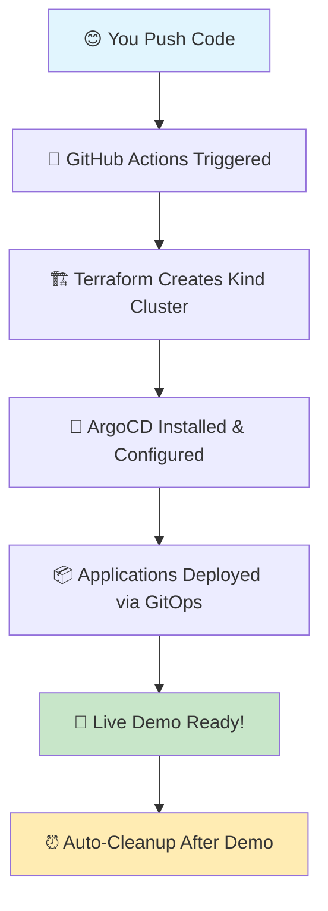

# 🚀 TCA-InfraForge: Cloud-Native Development Platform
**Production-Grade GitOps Environment for Development Teams**

*"Move beyond localhost - Experience real cloud-native development with enterprise-grade tooling"*Hey Future Temitayo! Welcome to TCA-InfraForge 
**Your Personal GitOps Playground & Career Portfolio**

*"Past Tayo built this for Future Tayo with lots of love and documentation ❤️"*

[![Deploy ArgoCD Demo](https://github.com/your-username/TCA-InfraForge/acti## 🤝 Contributing & Community

### **👥 Team Onboarding**
New team members can get started in minutes:
```bash
# 1. Fork this repository
# 2. Create your development branch: dev/your-name  
# 3. Run the setup script: ./scripts/setup-dev-environment.sh your-name
# 4. Start deploying applications to your dedicated namespace
```

### **📋 Development Guidelines**
- **Branch naming:** `dev/your-name` for personal development
- **Application naming:** `your-name-app-name` to avoid conflicts
- **Namespace usage:** Deploy only to your assigned `dev-your-name` namespace
- **Resource limits:** Respect the configured quotas for fair resource sharing
- **Security:** Follow security policies - no privileged containers or host access

### **🆘 Getting Help**
- **Platform issues:** Create GitHub issue with `platform` label
- **Application issues:** Check your dedicated Grafana dashboard first
- **Service mesh problems:** Use Kiali to debug traffic flow
- **Access issues:** Verify your RBAC permissions in ArgoCD

### **🔧 Platform Maintenance**
- **Monitoring:** Platform health monitored via Grafana dashboards
- **Updates:** Platform components updated via GitOps workflows  
- **Backup:** Development data backed up daily (restore via scripts)
- **Security:** Automated vulnerability scanning and policy enforcement

## 📞 Platform Information

**TCA-InfraForge Development Platform**
- 🌐 **Platform URL:** `https://tca-infraforge.dev`
- 📊 **Status Page:** `https://status.tca-infraforge.dev`
- 📚 **Documentation:** This repository + `/docs` folder
- 🐙 **Source Code:** GitHub repository (you're here!)
- 🎓 **Learning Path:** See `/docs/learning-path.md`

---

*Built with enterprise-grade tooling for cloud-native development teams*ws/deploy-argocd.yml/badge.svg)](https://github.com/your-username/TCA-InfraForge/actions/workflows/deploy-argocd.yml)
[](https://terraform.io)
[](https://kubernetes.io)
[](https://argoproj.github.io/cd/)

---

## 🎯 What is TCA-InfraForge?

**A complete cloud-native development platform** that bridges the gap between localhost development and production environments. Built for development teams who want to:

- 🌩️ **Experience real cloud-native workflows** without cloud costs
- 🔧 **Learn production-grade tooling** in a safe environment  
- 🤝 **Collaborate on GitOps practices** with dedicated environments
- 📊 **Integrate enterprise monitoring** and observability stack
- 🕸️ **Experiment with service mesh** and advanced networking
- 🔐 **Practice authentication** and security patterns

### 🎯 **Getting Started:**

1. **🚀 Deploy Your Environment** → Click `Actions` tab → Run `Deploy Development Platform`
2. **🔑 Get Your Credentials** → Each team member gets dedicated access
3. **🎨 Create Your Branch** → Deploy your applications in isolated namespaces
4. **� Monitor Everything** → Full observability stack included
5. **🤝 Collaborate** → Learn GitOps with your team

---

## 🏗️ Production-Grade Architecture

### 🎯 **The Development Challenge Solved:**
- **Localhost limitations** → No real networking, service discovery, or cloud patterns
- **Production gaps** → Huge leap from local dev to production complexity  
- **Team collaboration** → Difficult to share and test integrations locally
- **Enterprise tooling** → Need experience with monitoring, service mesh, security
- **Cost barriers** → Cloud environments are expensive for learning

### 🌟 **What TCA-InfraForge Provides:**
```
Complete cloud-native development platform featuring:
├── 🎯 Multi-tenant GitOps (ArgoCD + per-developer namespaces)
├── 📊 Enterprise monitoring (Prometheus, Grafana, Jaeger, Kiali)
├── 🕸️ Service mesh networking (Istio with mTLS and traffic management)
├── 🔐 Authentication & authorization (OAuth2, RBAC, service accounts)
├── 🚨 Alerting & incident response (AlertManager, PagerDuty integration)
├── 📝 Centralized logging (ELK stack with log aggregation)
├── 🔒 Security scanning (Trivy, Falco, OPA Gatekeeper policies)
└── 🌐 Ingress & load balancing (Nginx Ingress, cert-manager)
```

### 🏗️ **Enterprise-Grade Tech Stack:**
| Component | Tool | Purpose |
|-----------|------|---------|
| **Orchestration** | Kubernetes (Kind) | Container orchestration |
| **GitOps** | ArgoCD | Declarative deployments |
| **Service Mesh** | Istio | Traffic management, security, observability |
| **Monitoring** | Prometheus + Grafana | Metrics collection and visualization |
| **Tracing** | Jaeger | Distributed tracing |
| **Logging** | ELK Stack | Centralized log management |
| **Security** | Falco, OPA Gatekeeper | Runtime security, policy enforcement |
| **Ingress** | Nginx Ingress Controller | Load balancing, SSL termination |
| **Secrets** | External Secrets Operator | Secret management |

### 🧬 **The Tech Stack You Chose & Why:**
- **🐳 Kind (Kubernetes in Docker)** → Fast, free, runs anywhere
- **🏗️ Terraform** → Infrastructure as Code (you love IaC!)
- **� ArgoCD** → GitOps made simple and visual
- **⚡ GitHub Actions** → Free CI/CD for public repos
- **📦 Helm** → Package management for Kubernetes
- **🎨 Kustomize** → Configuration management without templates

---

## 👥 Multi-Developer Workflow

### **🌿 Branch-Based Development**

Each developer gets their own isolated environment:

**Step 1: Create Your Development Branch**
```bash
git checkout -b dev/your-name
mkdir -p argocd/applications/dev-your-name/
```

**Step 2: Deploy Your Applications**
```bash
# Copy the template application
cp argocd/applications/tca-metrics-server.yaml \
   argocd/applications/dev-your-name/my-application.yaml

# Edit for your namespace
sed -i 's/namespace: kube-system/namespace: dev-your-name/' \
   argocd/applications/dev-your-name/my-application.yaml
```

**Step 3: Commit and Deploy**
```bash
git add .
git commit -m "feat: add my development application"
git push origin dev/your-name

# Trigger deployment
gh workflow run "Deploy Development Platform" --ref dev/your-name
```

### **🔐 Per-Developer Authentication**

Each developer gets:
- 🎯 **Dedicated namespace** (`dev-{your-name}`)
- 🔑 **ArgoCD user account** with namespace-scoped permissions
- 📊 **Monitoring dashboards** filtered to your applications
- � **Alert routing** to your preferred channels
- 🌐 **Ingress URLs** with your subdomain (`your-name.tca-infraforge.dev`)

### **🎯 Development Workflow Demo**
```
1. Developer creates branch: dev/alice
2. Deploys microservice with monitoring
3. Service mesh automatically handles:
   ├── mTLS between services
   ├── Traffic routing and load balancing  
   ├── Distributed tracing
   └── Circuit breaking
4. Full observability stack shows:
   ├── Service topology in Kiali
   ├── Performance metrics in Grafana
   ├── Request tracing in Jaeger
   └── Logs aggregated in Kibana
```

---

## � Platform Structure

```
TCA-InfraForge/                           ← Production-grade development platform
├── 📖 README.md                          ← Platform documentation
├── 🚀 .github/workflows/                 
│   ├── deploy-platform.yml              ← Full platform deployment
│   ├── destroy-environment.yml          ← Environment cleanup
│   └── security-scan.yml               ← Security and compliance checks
├── 🏗️ terraform/                         
│   ├── platform/                        ← Core infrastructure
│   ├── monitoring/                      ← Observability stack
│   ├── security/                        ← Security and policies
│   └── networking/                      ← Service mesh and ingress
├── 🎯 argocd/                           
│   ├── platform-apps/                  ← Platform-level applications
│   ├── applications/                   ← User applications
│   │   ├── shared/                     ← Shared services
│   │   └── dev-{name}/                 ← Per-developer namespaces
│   └── projects/                       ← RBAC and project definitions
├── 📊 monitoring/                       
│   ├── prometheus/                     ← Metrics collection
│   ├── grafana/                        ← Visualization dashboards  
│   ├── jaeger/                         ← Distributed tracing
│   └── elk/                            ← Logging stack
├── 🕸️ service-mesh/                     
│   ├── istio/                          ← Service mesh configuration
│   ├── security/                       ← mTLS and policies
│   └── traffic-management/             ← Routing and load balancing
└── 🔧 scripts/                          
    ├── setup-dev-environment.sh       ← Developer onboarding
    ├── generate-certificates.sh       ← SSL certificate management
    └── backup-restore.sh              ← Data persistence
```

### 🎯 **Developer Quick Actions:**
- **Create new environment** → `scripts/setup-dev-environment.sh {your-name}`
- **Deploy application** → Add to `argocd/applications/dev-{your-name}/`
- **Monitor services** → Access Grafana at `grafana.tca-infraforge.dev`
- **Debug issues** → Check Jaeger traces at `jaeger.tca-infraforge.dev`
- **View logs** → Kibana dashboard at `logs.tca-infraforge.dev`

---

## 🏗️ The Complete Flow (Your Architecture Brain Dump)



**The Magic Happens Like This:**
1. **You commit code** → GitHub detects the change
2. **GitHub spins up Ubuntu VM** → Starts your workflow  
3. **Terraform runs** → Creates Kubernetes cluster in Docker
4. **ArgoCD gets installed** → Your GitOps control center
5. **Applications deploy** → ArgoCD pulls from Git and applies to cluster
6. **You get live URLs** → Demo ready for 15 minutes
7. **Auto-cleanup** → Everything gets destroyed (no costs!)

---

## 🆘 Emergency Troubleshooting (For Bad Days)

### 😱 **"The Demo Failed! Help!"**

**Check #1: GitHub Actions Status**
```bash
# Go to Actions tab → Look for red ❌ 
# Click the failed run → Read the logs
# 90% of issues are in the logs with clear error messages
```

**Check #2: Are You Out of Minutes?**
```
Private repo? Check if you exceeded 2,000 free minutes/month
Public repo? Should be unlimited (make sure repo is actually public)
```

**Check #3: Common Fixes**
```bash
# Re-run the workflow (often fixes transient issues)
# Check if Docker/Kind had issues in the logs
# Verify Terraform syntax if you changed anything
```

### 🤔 **"I Forgot How to Use This!"**

**Quick Refresher:**
1. **This repo is PUBLIC** → Anyone can see it (that's intentional for portfolio!)
2. **Company work is SEPARATE** → In `/Users/charlie/Documents/ArgoCD-gitops/`
3. **To run a demo** → Actions tab → Deploy ArgoCD Demo → Run workflow
4. **To modify** → Edit files → Commit → Push → Demo reflects changes

### 🔧 **"I Want to Add More Applications!"**

**Easy Steps:**
1. Copy `argocd/applications/tca-metrics-server.yaml`
2. Rename it (e.g., `tca-prometheus.yaml`)
3. Change the `name`, `chart`, and `values` sections
4. Commit and push → ArgoCD will deploy it automatically!

---

## 🎓 Learning Path (Grow Your Skills)

### **Level 1: GitOps Basics** *(You're probably here)*
- ✅ Understand Git as source of truth
- ✅ Know what ArgoCD does
- ✅ Can deploy simple applications
- **Next:** Learn Kustomize overlays for environments

### **Level 2: Advanced GitOps** *(Your next milestone)*  
- 🎯 Multi-environment deployments (dev/staging/prod)
- 🎯 Application sync policies and health checks
- 🎯 ArgoCD projects and RBAC
- **Next:** Integrate monitoring and observability

### **Level 3: Production Ready** *(Future goal)*
- 🚀 Sealed secrets management
- 🚀 Progressive deployment strategies
- 🚀 Disaster recovery procedures
- **Next:** Multi-cluster management

### **📚 Recommended Reading When You Have Time:**
- [ArgoCD Best Practices](https://argo-cd.readthedocs.io/en/stable/user-guide/best_practices/)
- [GitOps Principles](https://opengitops.dev/)
- [Kubernetes Patterns](https://kubernetes.io/docs/concepts/)

---

## � Professional Skills Showcase

**Future Tayo, here's what you're demonstrating to employers:**

### **🏆 Core Competencies:**
| Skill | Evidence in This Repo | Interview Talking Points |
|-------|----------------------|-------------------------|
| **GitOps** | ArgoCD manages all deployments | "I implement GitOps for declarative infrastructure" |
| **IaC** | Terraform provisions everything | "Infrastructure is code, version-controlled, and reproducible" |  
| **CI/CD** | GitHub Actions automates workflows | "I build automated pipelines with proper testing" |
| **Kubernetes** | Kind cluster + real workloads | "I deploy and manage containerized applications" |
| **Documentation** | This comprehensive README | "I believe in self-documenting, maintainable systems" |

### **� What Makes You Stand Out:**
- ✨ **Live Demos** → You can show, not just tell
- ✨ **Real Infrastructure** → Not just theory, actual running systems  
- ✨ **Cost Conscious** → Built entirely on free tier (shows business acumen)
- ✨ **Documentation** → Shows you think about maintainability
- ✨ **Separation of Concerns** → Company work vs personal projects properly isolated

---

## 🎯 Quick Actions (For When You're In a Hurry)

### **⚡ 2-Minute Demo Setup:**
```
1. Click "Actions" tab
2. Click "🚀 TCA-InfraForge ArgoCD Demo"
3. Click "Run workflow" → Select 15 minutes
4. Wait 10 minutes → Get demo URLs
```

### **⚡ 5-Minute Code Changes:**
```bash
# To add a new application:
cp argocd/applications/tca-metrics-server.yaml argocd/applications/tca-prometheus.yaml
# Edit the new file, commit, push → Done!
```

### **⚡ Interview Prep Checklist:**
```
□ Run demo once to verify it works
□ Prepare to explain GitOps principles  
□ Know the architecture flow by heart
□ Have examples ready of when you'd use this in production
□ Be ready to discuss scaling and security considerations
```

---

## 🔮 Future Enhancements (Ideas for Later)

**When you have more time and energy:**

### **Phase 2: Multi-Environment**
- [ ] Add staging/prod overlays with Kustomize
- [ ] Implement promotion workflows (dev → staging → prod)
- [ ] Add environment-specific configurations

### **Phase 3: Advanced Features**  
- [ ] Integrate Prometheus + Grafana monitoring
- [ ] Add sealed-secrets for secret management
- [ ] Implement progressive deployment (blue/green, canary)

### **Phase 4: Production Ready**
- [ ] Add policy enforcement (OPA Gatekeeper)
- [ ] Implement backup/restore procedures  
- [ ] Multi-cluster ArgoCD setup

**💡 Pro Tip:** Only tackle these when the current setup is working perfectly!

---

## 🎭 Context Switching Helper (Never Get Confused Again!)

**Future Tayo, when you're juggling multiple projects:**

### **🏢 This is TCA-InfraForge (Public Portfolio):**
- � **Location:** `/Users/charlie/Documents/TCA-InfraForge/`
- 🎯 **Purpose:** Career advancement, learning, interviews
- 👀 **Visibility:** Public (everyone can see this - that's intentional!)
- 💰 **Cost:** $0 forever
- 🚀 **Use for:** Demos, learning, showing off your skills

### **🏢 That is Company Work (Private):**  
- 📍 **Location:** `/Users/charlie/Documents/ArgoCD-gitops/`
- 🎯 **Purpose:** Company projects, client work
- 👀 **Visibility:** Private/confidential
- 💰 **Cost:** Company pays
- 🔒 **Use for:** Work stuff only, never mix with personal

### **🧠 Mental Model:**
```
When in doubt, ask yourself:
"Would I be comfortable showing this to a recruiter?"
├── YES → TCA-InfraForge (this repo)
└── NO → Keep in company directories
```

---

## 🎓 Enterprise Features Included

### **📊 Complete Observability Stack**
```yaml
Monitoring & Observability:
├── Prometheus → Metrics collection and alerting
├── Grafana → Visualization and dashboards  
├── Jaeger → Distributed tracing
├── Kiali → Service mesh observability
├── ELK Stack → Centralized logging
└── AlertManager → Incident management
```

### **🕸️ Service Mesh Integration**
```yaml
Istio Service Mesh:
├── Automatic mTLS → Zero-trust networking
├── Traffic Management → Canary deployments, A/B testing
├── Security Policies → Network and authorization policies
├── Observability → Automatic metrics and tracing
└── Fault Injection → Chaos engineering capabilities
```

### **🔐 Security & Compliance**
```yaml
Security Features:
├── OPA Gatekeeper → Policy enforcement
├── Falco → Runtime security monitoring  
├── Trivy → Container vulnerability scanning
├── Network Policies → Microsegmentation
├── RBAC → Fine-grained access control
└── Cert Manager → Automatic TLS certificates
```

### **🤝 Developer Experience**
```yaml
Self-Service Platform:
├── Automated onboarding → One-command environment setup
├── Template applications → Quickstart for common patterns
├── Integrated debugging → Logs, metrics, traces in one place
├── GitOps workflows → Push-to-deploy simplicity
└── Documentation → Runbooks and troubleshooting guides
```

## 🚀 Getting Started Guide

### **Step 1: Deploy the Platform** (10 minutes)
```bash
# Clone and setup
git clone https://github.com/your-org/TCA-InfraForge.git
cd TCA-InfraForge

# Deploy full platform via GitHub Actions
gh workflow run "Deploy Development Platform" --ref main
```

### **Step 2: Create Your Development Environment** (2 minutes)  
```bash
# Setup your dedicated namespace
./scripts/setup-dev-environment.sh your-name

# Access your dashboards
echo "ArgoCD: https://argocd.tca-infraforge.dev"
echo "Grafana: https://grafana.tca-infraforge.dev"  
echo "Jaeger: https://jaeger.tca-infraforge.dev"
```

### **Step 3: Deploy Your First Application** (5 minutes)
```bash
# Create your branch
git checkout -b dev/your-name

# Copy application template
cp templates/microservice.yaml argocd/applications/dev-your-name/my-app.yaml

# Customize and deploy
git add . && git commit -m "feat: add my microservice"
git push origin dev/your-name
```

### **Step 4: Observe and Debug** (Ongoing)
```bash
# View service topology
open https://kiali.tca-infraforge.dev

# Check application metrics  
open https://grafana.tca-infraforge.dev/d/microservices

# Trace requests
open https://jaeger.tca-infraforge.dev
```

---

## �📞 Contact & Professional Links

**Temitayo Charles Akinniranye**
- 💼 LinkedIn: [Add your LinkedIn profile]
- 📧 Email: [Add your professional email]  
- 🌐 Portfolio: [Add your website/portfolio]
- 🐙 GitHub: [This repository showcases my GitOps skills]

---

*Built with ❤️, documentation, and lots of coffee by Past Tayo for Future Tayo*